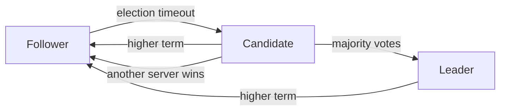

# RustyRaft

Rust implementation of the Raft consensus algorithm.

The goal of this project is not just to implement Raft, but to understand
how a distributed consensus system works by building it piece by piece.

The implementation is being designed so that the same Raft logic can later
be tested with deterministic failures such as:

- dropped messages
- delayed messages
- reordered messages
- duplicated messages
- network partitions
- node crashes
- node restarts
- storage failures

The main design principle is simple:

> Keep the Raft protocol separate from networking, storage and timing.

This makes the core logic easier to understand and, more importantly,
easier to test.

---

# Why RustyRaft?

Raft looks fairly simple when you read the high-level description:

- elect a leader
- replicate logs
- commit entries
- apply them to a state machine

The interesting part starts when things go wrong.

What happens when:

- two messages arrive in the wrong order?
- a message is lost?
- a follower crashes halfway through replication?
- the leader crashes?
- a node comes back with an old log?
- the network splits into two groups?
- an old RPC arrives after a new term has already started?

I want the implementation to make these cases testable instead of hiding
them behind threads, sleeps and real network connections.

That is the main reason the protocol logic is being kept separate from
networking, storage and timing.

---

# The basic idea

A Raft cluster has a number of servers.

At any point, a server is either:

- a follower
- a candidate
- a leader

The usual flow is:



The important thing is that these are states of the **same server**.
There isn't a completely different object for a leader or a follower.

---

# Terms

A term is Raft's logical clock.

```text
1 → 2 → 3 → 4 → 5
```

A server can move to a newer term, but never to an older one.

For example, if a server receives an RPC from term 8 while it is currently
in term 6, it has to update its term before continuing.

This is why `Term` is represented as its own type instead of passing
`u64` everywhere.

The same idea is used for `LogIndex`.

---

# The log

The Raft log is an ordered sequence of commands.

For example:

```text
index    term    command
----------------------------
  1        1     SET x=10
  2        1     SET y=20
  3        2     SET x=30
  4        3     SET z=40
```

There are two useful things to notice here.

First, the index belongs to the Raft protocol, so the implementation uses
a `LogIndex` type.

Second, an entry contains its term.

The term is not just metadata. It is used when comparing logs and when
deciding whether an entry can be committed.

---

# Why `LogIndex` starts at zero

Raft log entries are one-based.

The first real entry is index 1.

```text
index:

    0       1       2       3
    |       |       |       |
  before   first   second  third
```

`LogIndex::ZERO` therefore represents the position before the first entry.

This is useful because some Raft RPCs need to refer to the position just
before an entry.

Internally, the Rust `Vec` is still zero-based. `RaftLog` keeps that detail
inside the log implementation.

So the rest of the code can work with Raft indexes without worrying about
`Vec` indexes.

---

# Election

When a follower doesn't hear from a leader for long enough, it starts an
election.

It becomes a candidate, increments its term and votes for itself.

Then it asks the other servers for votes.

For a five-node cluster:

```text
          Candidate
          /   |   \
         /    |    \
       S2     S3    S4
                    |
                    S5
```

A majority is three.

So if the candidate gets:

```text
candidate + S2 + S3
```

it has enough votes to become leader.

Votes are kept in a `HashSet`.

That is intentional.

If the same response somehow arrives twice:

```text
S2 → vote
S2 → vote again
```

it must still count as one vote.

---

# Which candidate gets the vote?

A candidate does not automatically get a vote just because it asks for one.

Its log has to be sufficiently up-to-date.

Raft compares the last log entries like this:

```text
1. Compare last-log term
2. If the terms are equal, compare last-log index
```

For example:

```text
Candidate:  term 4, index 5
Follower:   term 3, index 100
```

The candidate is more up-to-date because term 4 is newer than term 3.

If the terms are equal:

```text
Candidate:  term 4, index 10
Follower:   term 4, index 8
```

the candidate with index 10 is more up-to-date.

I keep this comparison as a small independent function because it is a
Raft rule in its own right and should be easy to test.

See the `RequestVote` section of the
[Raft notes](https://github.com/souraavv/whitepapers-and-books/blob/main/whitepapers/raft.md#requestvote-rpc).

---

# RequestVote RPC

The request contains:

```text
term
candidate_id
last_log_index
last_log_term
```

The response contains:

```text
term
vote_granted
```

The RPC types themselves don't know how messages are transported.

That is deliberate.

I want the same RPC to work with:

- an in-memory test network
- a real network transport
- a network with dropped messages
- a network that delays messages
- a network that reorders messages

The message and the transport are two different things.

---

# Replication

After becoming leader, the server starts replicating its log to followers.

For every follower the leader keeps:

```text
next_index
match_index
```

Suppose the leader has:

```text
1  2  3  4  5  6  7
```

and a follower has:

```text
1  2  3  4
```

The leader can have:

```text
match_index = 4
next_index  = 5
```

Meaning:

```text
1  2  3  4 | 5  6  7
            |
            +-- follower is known to have
                everything up to here

               ^
               |
             next_index
```

If entry 5 is successfully replicated:

```text
match_index = 5
next_index  = 6
```

If replication fails, `next_index` moves backwards and the leader retries
with an earlier part of the log.

---

# Why `match_index` must not go backwards

This is one of the first places where thinking about the network matters.

Imagine two replication requests:

```text
request A → index 7
request B → index 5
```

The responses can arrive in the opposite order.

If the response for index 7 arrives first:

```text
match_index = 7
```

and the old response for index 5 arrives later, it must not change the
value back to 5.

So the update is effectively:

```text
match_index = max(
    current_match_index,
    replicated_index
)
```

This looks like a small detail, but it becomes important once the network
simulator starts deliberately reordering messages.

---

# AppendEntries

The leader uses `AppendEntries` to replicate entries to followers.

It is also used for heartbeats.

A heartbeat is simply an `AppendEntries` RPC with no entries:

```text
entries = []
```

The important fields are:

```text
term
leader_id
prev_log_index
prev_log_term
entries
leader_commit
```

The `prev_log_index` and `prev_log_term` fields are what allow a follower
to check that its log agrees with the leader at the point where the new
entries are going to be added.

For example:

```text
Leader:

1   2   3   4
    |   |   |
    +---+---+

Follower:

1   2   3
    |   |
    +---+
```

The leader can say:

```text
prev_log_index = 3
prev_log_term  = 2
entries        = entry 4
```

The follower first checks its entry at index 3.

If the index and term do not match, the request cannot be applied yet.

If they match, the follower can continue with the new entries.

See the
[AppendEntries RPC](https://github.com/souraavv/whitepapers-and-books/blob/main/whitepapers/raft.md#appendentries-rpc)
section in the notes.

---

# Replication is not commitment

This distinction is important.

Suppose a five-node cluster has:

```text
Server 1   entry 10 ✓
Server 2   entry 10 ✓
Server 3   entry 10 ✓
Server 4   entry 10 ✗
Server 5   entry 10 ✗
```

Three out of five servers have the entry.

That is a majority.

The leader can therefore consider the entry committed, provided the
current-term rule is satisfied.

So the flow is:


`match_index` answers:

> How far do I know this follower has replicated?

`commit_index` answers:

> How far is it safe for the cluster to consider committed?

These are different pieces of state and are kept separate in the
implementation.

---

# Commit index

The current commit calculation looks for the highest index that:

1. has been replicated on a majority of servers
2. belongs to the leader's current term
3. is ahead of the current `commit_index`

For example:

```text
match indexes:

S1 → 7
S2 → 7
S3 → 6
S4 → 5
S5 → 4
```

If index 6 belongs to the current term, then:

```text
S1 → 6 ✓
S2 → 6 ✓
S3 → 6 ✓
```

Three servers have it.

So:

```text
commit_index = 6
```

The important part is that the leader does not simply say:

> "Most servers have this entry, therefore commit it."

The current-term rule matters too.

---

# Why commitment is separate from replication

It would be tempting to put commit logic directly inside the replication
code.

I'm deliberately not doing that.

Replication answers one question:

```text
Did the follower replicate the entry?
```

Commitment answers another:

```text
Is this entry now committed?
```

Keeping those decisions separate makes the code easier to reason about and
makes each rule independently testable.

---

# State machine

The log is not the state machine.

The log contains commands:

```text
SET x=10
SET x=20
SET y=30
```

The state machine applies committed commands:

```text
x = 20
y = 30
```

The intended flow is:


A command should only reach the state machine after the corresponding log
entry is committed.

This part will be implemented separately from the log itself.

---

# Why the implementation is split this way

The main design decision is to keep the protocol independent from its
environment.

For example, election logic should not need to know how a timer is
implemented.

Replication should not need to know whether an RPC went through TCP.

Commit calculation should not need to know how the log is stored on disk.

Instead:

```text
Raft logic
    |
    +-- storage
    |
    +-- transport
    |
    +-- timer
    |
    +-- state machine
```

can be connected later.

This is especially useful for testing.

---

# Testing

The first tests are deliberately small.

For example:

```text
Term
    ↓
does the term increase correctly?

Log
    ↓
does append return the correct index?

Election
    ↓
does a duplicate vote count twice?

Replication
    ↓
can match_index move backwards?

Commit
    ↓
does a majority actually commit an entry?
```

These tests don't try to simulate a complete cluster yet.

That comes later.

The reason is simple: when a small rule is wrong, I want the test to tell
me exactly which rule is wrong.

---

# The real tests come later

The more interesting part of this project will be the deterministic
cluster tests.

Eventually I want to be able to create scenarios such as:

```text
leader
  |
  +---- message dropped
  |
  +---- message delayed
  |
  +---- follower crashes
  |
  +---- network partition
  |
  +---- follower restarts
```

and then verify the Raft invariants.

The network should be something the test can control.

For example:

```text
send(message)
      |
      +---- deliver immediately
      |
      +---- delay
      |
      +---- drop
      |
      +---- duplicate
      |
      +---- reorder
```

That is one of the main reasons the transport layer is not mixed into the
Raft protocol.

---

# Deterministic failures

I don't want tests that fail once every few hundred runs because of timing.

A future test should be able to say:

```text
seed = 12345

start cluster

elect leader

partition node 3

drop message 17

delay message 21

crash node 4

restart node 4

heal partition

deliver delayed messages

verify invariants
```

If the test fails, the same seed and sequence should reproduce the failure.

This should make debugging distributed behavior much less painful.

---

# Logging

Logging is part of the implementation rather than something added at the
end.

The project uses `tracing`.

The levels have roughly this meaning:

```text
ERROR  something is broken
WARN   something unexpected happened
INFO   important protocol event
DEBUG  useful implementation details
TRACE  very detailed execution
```

For example:

```rust
tracing::info!(
    old_commit_index = current_commit.value(),
    new_commit_index = candidate.value(),
    term = current_term.value(),
    "Commit index advanced"
);
```

The message is readable, while the fields remain structured.

This should become particularly useful once several nodes are running at
the same time.

---

# A few design rules

There are a few rules I'm trying to keep throughout the implementation.

## Keep protocol rules small

If a function can answer one Raft question, let it answer that one question.

For example:

```text
is_log_up_to_date()
```

should answer whether a candidate's log is sufficiently up-to-date.

It shouldn't also start an election, send an RPC and modify the node.

---

## Don't optimize before there is a reason

Some structures are intentionally simple right now.

For example, follower replication state currently uses a `Vec`.

A `HashMap` or another structure might eventually make sense for a very
large cluster.

But correctness comes first.

```text
correctness
    ↓
tests
    ↓
measure
    ↓
optimize
```

---

## Keep infrastructure out of the protocol

No sockets inside election logic.

No file operations inside replication logic.

No `sleep()` inside Raft state transitions.

No real network required to test a Raft rule.

This makes the code easier to understand and gives the test simulator
control over the environment.

---

## Make failure normal

A distributed system has to assume that things fail.

A dropped message isn't an exceptional situation that the test suite should
avoid.

It is exactly the kind of situation the implementation needs to handle.

---

# References

The main reference for the implementation is the Raft paper.

- [Raft: In Search of an Understandable Consensus Algorithm](https://raft.github.io/raft.pdf)
- [My Raft notes](https://github.com/souraavv/whitepapers-and-books/blob/main/whitepapers/raft.md)
- [AppendEntries RPC notes](https://github.com/souraavv/whitepapers-and-books/blob/main/whitepapers/raft.md#appendentries-rpc)

The implementation is being built from the protocol described in these
references, but the code is intentionally kept small and readable.

The idea is to understand each rule before connecting it to the next one.