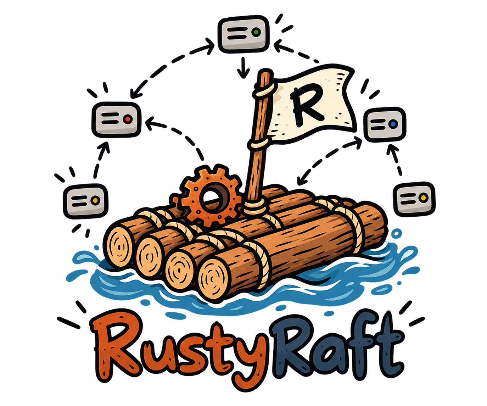

  

### RustyRaft

Rust implementation of the Raft consensus algorithm.

The goal of this project is not just to implement Raft, but to understand
how a distributed consensus system works by building it piece by piece.

The implementation is being designed so that the same Raft logic can later
be tested with deterministic failures such as:

- dropped messages
- delayed messages
- reordered messages
- duplicated messages
- network partitions
- node crashes
- node restarts
- storage failures

The main design principle is simple:
Keep the Raft protocol separate from networking, storage and timing.

This makes the core logic easier to understand and, easier to test.

### References

The main reference for the implementation is the Raft paper.

- [Raft: In Search of an Understandable Consensus Algorithm](https://raft.github.io/raft.pdf)
- [My Raft notes](https://github.com/souraavv/whitepapers-and-books/blob/main/whitepapers/raft.md)
